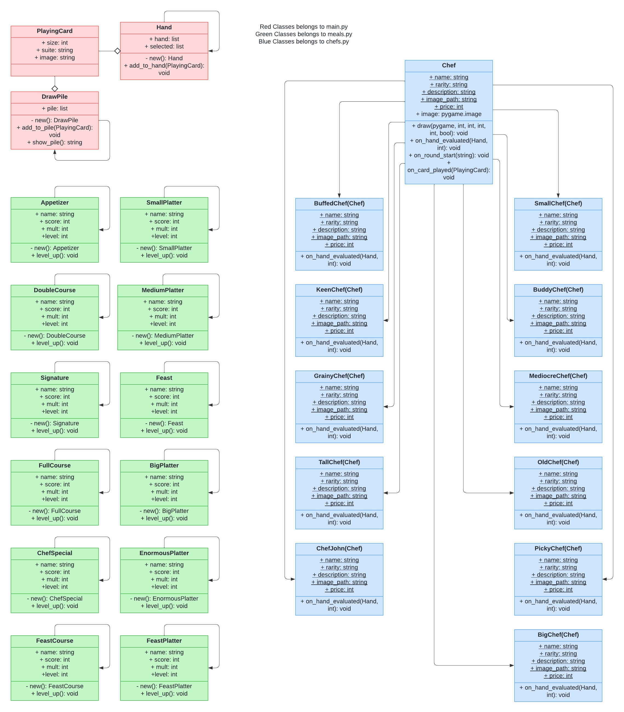

# Project Overview
Bologna Kitchen is a Rogue-like game that you play as a chef in an high-stake underground cooking competition, and you have to cook the best meal ever made by combining various ingredients cards and using strong utensils. Become the strongest chef of the universe today.

# Project Review
The so-called original project is a Rogue-like game called Balatro, Bologna Kitchen is a mere replica of the game, the difference is that we are using Python to create the game bit-by-bit and the theme now changes, implementing that we can make different in-game mechanics, such as; new categories of power-up cards, and such,

# Programming Development
## 3.1 Game Concept
In this game, you must draw ingredient cards from the draw pile, you may pick to discard or play those cards, combining those cards will give a score based on the combination. The game also presents spice cards that can make your deck of ingredients stronger, and also chef cards that help you in order to score bigger points.

## 3.2 UML Design

## 3.3 YouTube Link
[www.youtube.com/watch?v=2aedgE6q7lI&t](www.youtube.com/watch?v=2aedgE6q7lI&t)

## 3.4 Algorithms Involved
This game is mainly based on simple math multiplication and addition, the game for its root isn’t complicated, what will be complicated is that each hand draw will be randomized from the draw pile, but the cards within your hand is able to be sorted by rank and suite, similar to the base game, which will probably utilizes sorting algorithms; that will need a lot of optimization in order to make the “sort option” fast enough to feel plausible to play. Another thing is that maybe we need to make a guarantee system in order to have a sort of “pity” system that doesn’t make the game’s randomness too tedious to deal with.

# Statistical Data (Prob Stats)
## 4.1 Data Features
- Played Hands this run
- Card Played
- Card Discarded
- Chefs Bought
- Shop Activities

## 4.2 Data Recording Method
Everything will be recorded in csv files within the data folder of the game repository, there are log functions within the game code which does the recording for each of the data.

## 4.3 Data Analysis Report
You are able to view the recorded data whenever you want, by clicking “P” on your keyboard. The statistics will be shown as a bar graph or pie charts for each of the 5 data points, data will be updated real time.

# Final Changes
## 5.1 Utensil Cards
I didn't implemented utensil cards because from my point of view, it is pretty unnesseary to have multiple power up systems in game, it could not only cause confusion but also make the game overwhelming.
## 5.2 Bag
I didn't implemented the bag because after I've tried making the spice cards, it doesn't have any downsides in game when used, so the bag would be pretty pointless to add if the user will just use the power up right away.
## 5.3 Data Collection Class
Instead of a class that collects data, I've moved it to functions instead because using a class would unnessesarily overcomplicate the system, making it harder to manuver.
## 5.4 Data Collection Process
Instead of having to collect data after each rounds, I've made it so that the data collection happens real time, so the game would update more fluidly.